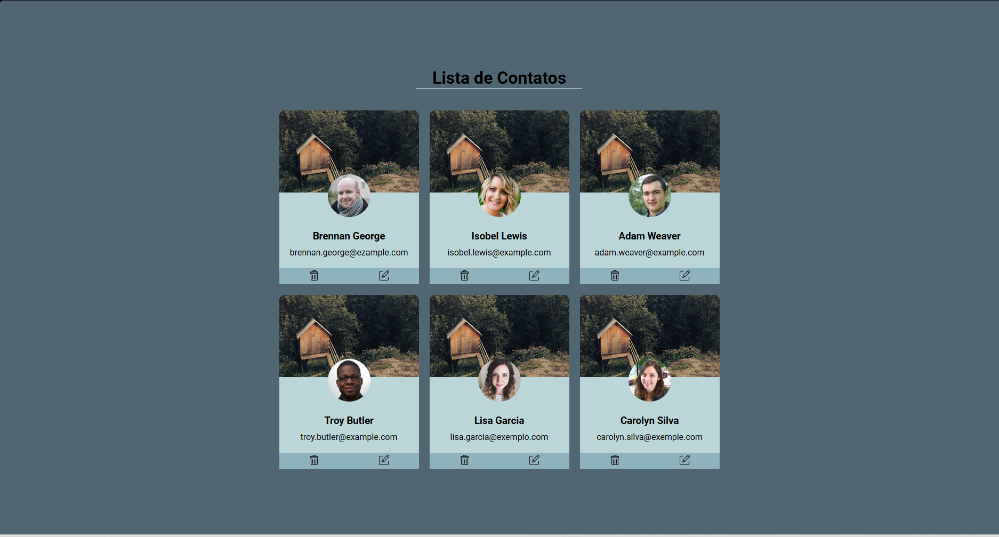

# lista-contatos-web  

---

## Descrição
Projeto de **Lista de Contatos** desenvolvido com **HTML5** e **CSS3**.  
Permite exibir contatos com foto, nome, email e botões para **editar** ou **deletar**.  
O projeto foca em **layout responsivo**, **Flexbox**, **estilização de imagens** e **tipografia personalizada**.

---

## Tecnologias
- HTML5  
- CSS3  
- Flexbox  
- Google Fonts:
  - Roboto

## Funcionalidades
- Lista de contatos com:
  - Foto (em formato redondo)
  - Nome e email
- Botões para editar ou deletar cada contato (somente visual, sem backend)
- Layout responsivo utilizando Flexbox
- Estilização com cores suaves e bordas arredondadas
- Fonte personalizada via Google Fonts

## Demonstração

## Áreas para Melhoria
- **Adicionar interatividade real:** criar funções em JavaScript para deletar e editar contatos.
- **Responsividade aprimorada:** otimizar exibição em dispositivos móveis menores.
- **Validação de dados:** impedir emails duplicados ou inválidos.
- **Backend e persistência:** integrar banco de dados ou localStorage para salvar alterações.

## Conclusão
Projeto simples e funcional para praticar HTML e CSS.
Excelente para estudo de layout com Flexbox, estilização de listas e tipografia personalizada.
Pode ser expandido futuramente com JavaScript e backend para funcionalidades completas.

## Contato
- Desenvolvedor: Lucas Carvalho
- Email: lucascarvalhoptc06@gmail.com
